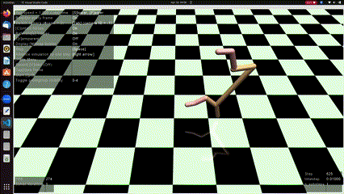
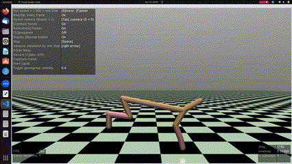
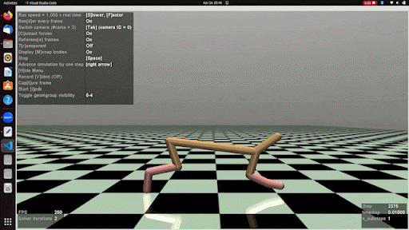
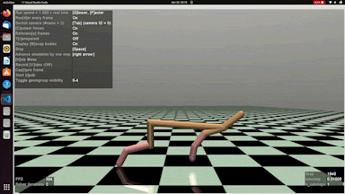
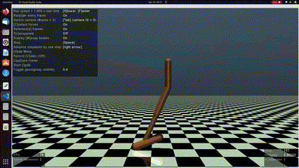
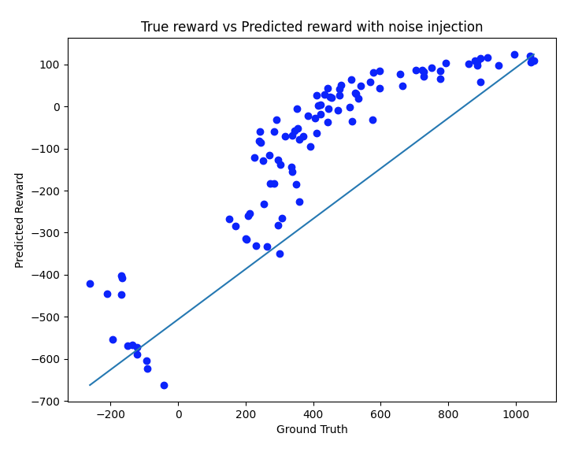
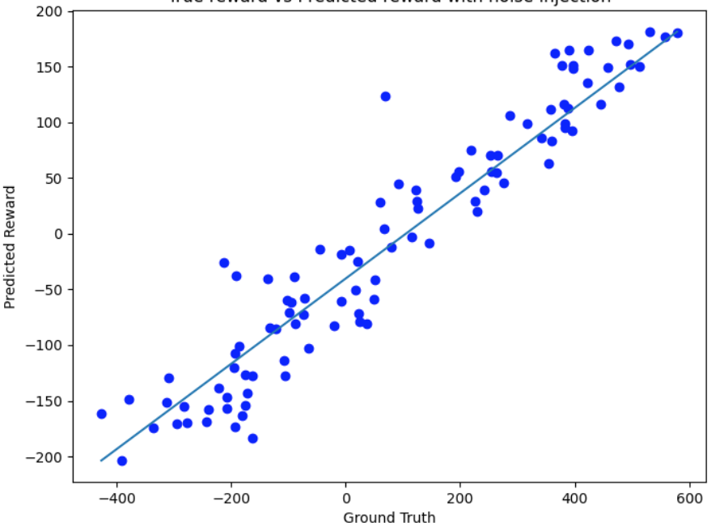

# Beyond-Demonstration
 CSE-598 Perception in Robotics Project ASU

 Implementation of [T-REX](http://proceedings.mlr.press/v97/brown19a/brown19a.pdf) and [D-REX](https://arxiv.org/pdf/1907.03976.pdf) IRL algorithm that learns a reward capturing the expert's intention from the demonstrations. The learnt reward can be used to train a policy that performs better than the demonstrations. Based on [stable_baselines3](https://stable-baselines3.readthedocs.io/en/master/#) and [imitation](https://imitation.readthedocs.io/en/latest/index.html) packages.

 Given a dataset of ranked sub-optimal demonstrations, a state dependent reward function can be recovered by training a neural network optimized on the preference of better demonstrations over the worst. The Bradley-Terry and Luce-Shephard [model](https://en.wikipedia.org/wiki/Bradley%E2%80%93Terry_model) of choice is used to train such reward models from preferences. Ranked trajectories can be generated by injecting different levels of noise into a [BC](https://www.ri.cmu.edu/pub_files/pub3/pomerleau_dean_1991_1/pomerleau_dean_1991_1.pdf) policy trained on the demonstrations.
 
 Example of 3 ranked trajectories generated by noise injection.

| High Noise | Mid Noise | No Noise |
| ------- | ------- | ------- |
|  |  |  |
| Least Preferred | More Preferred | Most Preferred |
 

 # Changes to Baseline
We implement the IRL algorithm using the tools available in the `imitation` library. Notable changes from the paper's implementation are
- Luce preference with discount_factor, noise_prob, clipped reward differences (ideas from [DRLHP](https://arxiv.org/pdf/1706.03741)): Comes with imitation library
- Mixed sampling: New preference dataset generated every epoch
- Fixed horizon rollouts for ranked_trajectories: Horizon length is 1000 steps
- Input normalization in reward network (similar to batch normalization): Comes with imitation library
- Single reward function No ensemble
- Reward scaling with tanh, optimized with AdamW: Scaled reward improves stability
- Entropy regularized actor critic policy for BC: Comes with imitation library

Other possible improvements
- Use custom rewards (rnn, attention)
- A better preference loss ([aLRP](https://arxiv.org/pdf/2009.13592))

# Results
Better than demonstrator performance was observed for HalfCheetah-v3 environment. For Hopper-v3, we achieved equal to demonstration performance.
| Demonstration | Learned Policy |
| ------- | ------- |
|  |   |
|  |   |

Ground Truth reward to Predicted reward corelation (unscaled)
| Hopper | HalfCheetah |
| ------- | ------- |
|  |   |
